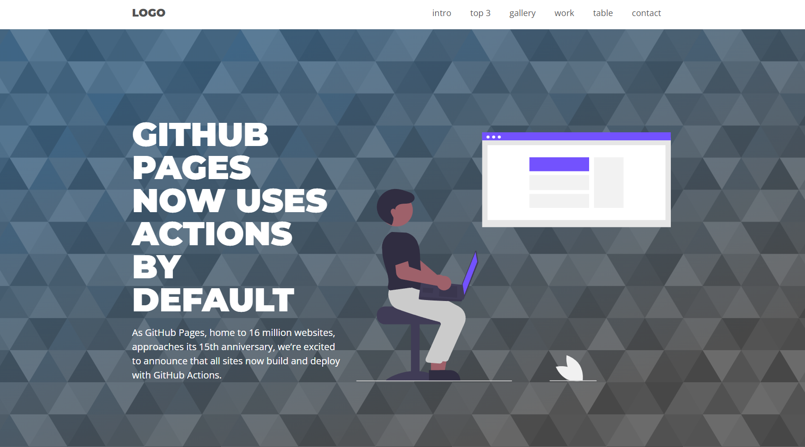

# landing-page-basica
<h1>Landing Page Básica</h1>

Uma landing page simples, criada ao fim do módulo de HTML e CSS do curso de JavaScript e TypeScript do professor Luiz Otávio Miranda.

A página foi feita utilizando vários elementos de HTML e CSS, e apenas uma linha de JavaScript para resolver o menu na versão mobile.

O site é totalmente responsivo, e mesmo simples o mesmo é bastante funcional.

A página está no ar <a href="https://landing-page-basica.netlify.app/">neste link</a>

<b>Obrigado por acessar!</b>

